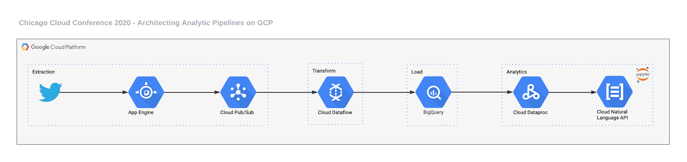

# Architecting Analytic Pipelines on GCP - Chicago Cloud Conference 2020

## Architecture



## Prerequisites

### Cloud Resources
- A PubSub topic
- A BigQuery table
- A GCS bucket called `chicago-cloud-conference-2020` (or similar, but make sure to update the scripts in the `bin`
folder)

### Environment variables
```shell script
export CONSUMER_KEY=${CONSUMER_KEY}
export CONSUMER_SECRET=${CONSUMER_SECRET}
export ACCESS_TOKEN=${ACCESS_TOKEN}
export ACCESS_SECRET=${ACCESS_SECRET}
export GOOGLE_APPLICATION_CREDENTIALS=${GOOGLE_APPLICATION_CREDENTIALS}
export TRACK=${TRACK}
```

## Deployment

### Cloud resources (table, topic, and bucket)
```shell script
$ ./bin/deploy_cloud_infrastructure.sh
```

### Streaming - App Engine
```shell script
$ ./bin/deploy_streaming.sh
```

### Transformation - Dataflow
```shell script
$ ./bin/deploy_streaming.sh
```

### Visualization - Dataproc
```shell script
$ ./bin/deploy_visualization.sh
```

### Deleting Apps
```shell script
$ ./bin/delete_apps.sh
```

### Notebook


### Sample Query
```sql
WITH
  DATA AS (
  SELECT
    SUBSTR(timestamp, 0, 10) AS tweet_timestamp,
    JSON_EXTRACT_ARRAY(SAFE_CONVERT_BYTES_TO_STRING(FROM_BASE64(payload)),
      "$[messages]") AS tweets
  FROM
    `ccc-2020-289323.chicago_cloud_conference.tweets`)
SELECT
  tweet_timestamp,
  REGEXP_REPLACE(IFNULL(JSON_EXTRACT_SCALAR(tweet_text,
        "$.data.retweeted_status.extended_tweet.full_text"),
      JSON_EXTRACT_SCALAR(tweet_text,
        "$.data.text")), r'\\n|\\t|\\"', '') AS user_text,
  JSON_EXTRACT_SCALAR(tweet_text,
    "$.data.user.screen_name") AS user_screen_nam,
  JSON_EXTRACT_SCALAR(tweet_text,
    "$.data.user.location") AS user_location,
  JSON_EXTRACT_SCALAR(tweet_text,
    "$.data.user.followers_count") AS user_followers_count
FROM
  DATA
CROSS JOIN
  UNNEST(tweets) AS tweet_text
LIMIT 5000;
```
